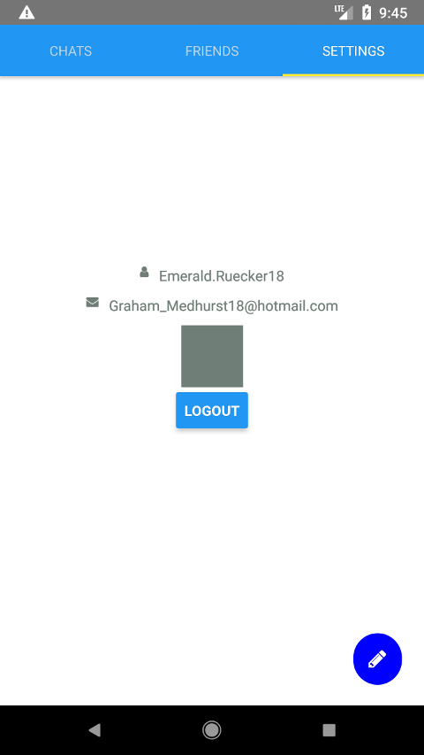
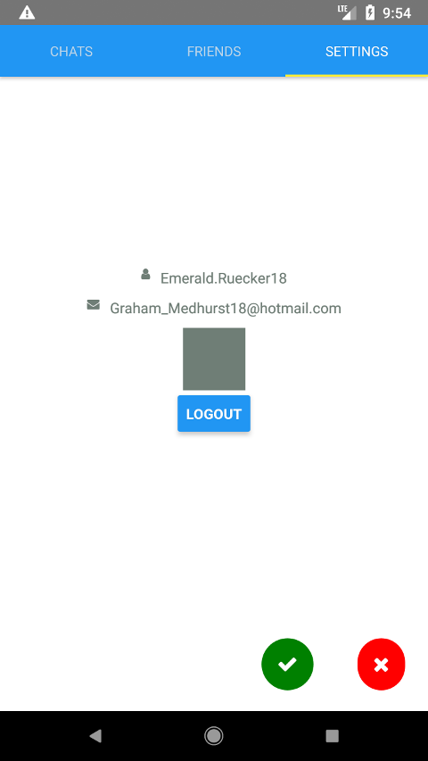
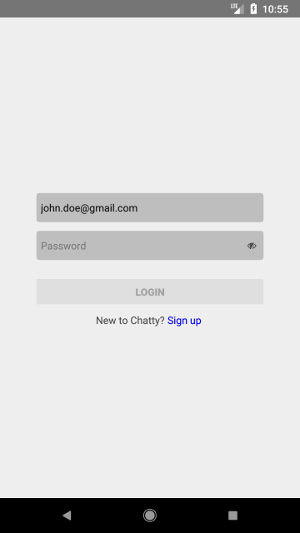

# Examen Segunda

# Día 11/02/2019 Tiempo: 5 horas

- Nota: Cada pregunta se valorará como bien o como mal (valoraciones intermedias serán excepcionales).
- Nota2: En cada pregunta se especifica si se valora en el examen de diseño o en el de desarrollo.
- Nota3: Para aprobar cada examen hay que obtener una puntuación mínima de 5 puntos en ese examen.
- Nota4: Organice su tiempo. Si no consigue resolver un apartado pase al siguiente. El examen consta de ejercicios que se pueden resolver de forma independiente. Los apartados de diseño y de desarrollo también se pueden resolver por separado. Si un apartado depende de otro que no sabe resolver, siempre puede dar una solución que aunque no sea correcta, le permita seguir avanzando.
- Nota5: Para que una solución sea correcta, no sólo hay que conseguir que haga lo que se pide, sino que además todo lo que funcionaba lo tiene que seguir haciendo.
- Nota6: En el examen se le da implementado el servidor y no se puede modificar. Cualquier modificación del servidor, invalidará las preguntas que se hayan resuelto y que usen esa modificación.
- Nota7: Lea completamente el examen antes de empezar y comience por lo que le parezca más fácil.

Pasos previos antes de empezar:

- Clone el repositorio del enunciado

```bash
    git clone https://user-daw-zayas@bitbucket.org/surtich/chatty-enunciado-segunda.git
```

- Configure su usuario de Git (es único para todos)

```bash
    cd chatty-enunciado-segunda
    git config user.name "user-daw-zayas"
    git config user.email "javier.perezarteaga@educa.madrid.org"
```

- Cree un _branch_ con su nombre y apellidos separados con guiones (no incluya mayúsculas, acentos o caracteres no alfabéticos, excepción hecha de los guiones). Ejemplo:

```bash
    git checkout -b fulanito-perez-gomez
```

- Compruebe que está en la rama correcta:

```bash
    git status
```

- Suba la rama al repositorio remoto:

```bash
    git push origin nombre-de-la-rama-dado-anteriormente
```

- Arranque el proyecto.

```bash
    # Instale dependencias del servidor
    yarn install

    # Inicie el servidor
    yarn dev

    # Instale dependencias del cliente
    cd client
    yarn install

    # Configure el cliente
    echo SERVER_URL=YOUR_IP:8080 > .env

    # Inicie el emulador de Andorid

    # Despliegue el cliente en el emulador
    react-native start --reset-cache
    react-native run-android

    # Abra una pestaña en el navegador con la librería color (le será útil durante la resolución del examen)
    google-chrome https://github.com/Qix-/color &
```

- Compruebe que la aplicación se ve en el móvil y que carga datos del servidor.

- Dígale al profesor que ya ha terminado para que compruebe que todo es correcto y desconecte la red.

## EXAMEN

#### 1.- (1 punto desarrollo) Refactorice el componente `signin.screen.js` en un mínimo de dos componentes situados en directorios `containers` y `components`. El primero tendrá la conexión a GraphQL y a Redux y el segundo recibirá datos y acciones cómo propiedades.

#### 2.- En la pantalla de `login` el usuario podrá visualizar su contraseña.

#### 2.1- (1 punto diseño) Muestre el icono con `name` `eye` con el estilo de la imagen.

Nota: debe respetar exactamente los estilos y se debe poder introducir la contraseña del usuario.



#### 2.2- (1 punto desarrollo) Al pulsar sobre el icono, su `name` cambiará a `eye-slash`.



#### 2.3- (1 punto diseño) La contraseña se mostrará u ocultará dependiendo del icono mostrado.


#### 3.- (1 punto diseño) En la pantalla de `login` no se podrá pulsar sobre `login` si no hay nombre de usuario o contraseña deshabilitando el botón. Tampoco se podrá pulsar si todos los caracteres introducidos son espacios en blanco.


#### 4.- En la pantalla de `signup` se podrá introducir el nombre del usuario y validar la contraseña.


#### 4.1- (1 punto diseño) Por respetar los estilos que se muestran en la imagen. Todos los campos tendrán `placeholder`.

#### 4.2- (1 punto diseño) Por deshabilitar el botón cuando alguno de los campos no tenga información (algún carácter diferente de espacio) o cuando las contraseñas no coincidan.

#### 4.3- (1 punto desarrollo) Refactorización para evitar la repeticón de código: Cree un componente que reutilice la funcionalidad de visualizar/ocultar la contraseña en las ventanas de `login` y `signup`.

Nota: En `signup` este componente se utiliza dos veces con los `placeholders` `password` y `password repeat` y en `login` una vez.

#### 4.4- (1 punto desarrollo) Al pulsar sobre `sign up` se llamará a la mutación del servidor (ya implementado) y se navegará a `login`, el usuario creado estará ya introducido y el campo de contraseña estará vacío.



#### 5.- En la pantalla de `settings` se visualizará el perfil del usuario.

#### 5.1- Al navegar a `settings` se visualizará el nombre y el correo electrónico del usuario conectado (iconos con `names` `envelope` y `user`).


#### 5.1.1- (1 punto diseño) Por respetar los estilos.

#### 5.1.2- (1 punto desarrollo) Por leer la información del usuario conectado del servidor.

#### 5.2- (1 puntos desarrollo) Se mostrará un botón `logout` y al pulsar sobre él se llamará a la acción de Redux `logout` y se navegará a la ventana de `login`.


#### 6.- En el servidor se ha asociado a cada usuario un objeto `profile` con la propiedad `color`. Al arrancar el servidor se crean usuarios con colores aleatorios. Al crear un usuario, si no se pasa color (ver más adelante), no tiene perfil. El esquema de GraphQL `User` tiene ahora una propiedad `profile`, que puede ser `null`.

#### 6.1- (1 punto diseño) Por mostrar lo que aparece en la imagen.


#### 6.2- (1 punto desarrollo) Cuando un usuario tenga `profile`, se mostrará su `color` y si no lo tiene, se mostrará `blue`.

#### 6.2b- (1 punto diseño) Además de mostrar el valor de la propiedad color, todos los textos e iconos estarán del color del perfil del usuario y el cuadrado se rellenará con ese color.


#### 7.- En la ventana de `signup` se podrá introducir el `color` del usuario.


#### 7.1- (1 punto diseño) Al navegar a `signup` se añadirá un campo de texto con el estilo de la imagen.


#### 7.2- (1 punto desarrollo) Al modificar el color se debe cambiar el color de fondo al color que se esté escribiendo o a gris si no es válido.

Nota: Este ejercicio puede resultar difícil para algunos. Requiere que use la librería `color` o que cree una función que "sepa" cuando un color es válido.

Nota2: Aquí va a tener un problema: según vaya tecleando habrá colores que serán válidos y otros que no lo sean. Cuando el color sea válido se pondrá ese color de fondo y cuando no lo sea se verá gris. ¿Cómo saber si un color es válido o no? La librería `color` le puede servir aquí. Consulte la documentación. Cuando construya un color, si el color no es válido, la librería `color` lanza una excepción. Así puede saber si un color es válido o no.


#### 7.3- (1 punto diseño) Al cambiar el color de fondo, si este es oscuro, no se verá lo que está escribiendo. Modifique el color de la letra para que siempre sea visible independientemente del color de fondo.

Nota: La librería `color` puede ser de ayuda aquí, aunque tampoco es complicado haberlo creando una función.


#### 7.4- (1 punto desarrollo) El botón `sign up` estará deshabilitado si el color no es válido.

Nota: Tenga en cuenta que no es obligatorio introducir color, con lo cuál, será valido tener el campo de color vacío.

#### 7.5- (1 punto desarrollo) Al pulsar sobre `sign up` se llamará a la mutación `signup` pasando el color. Observe que en el servidor, en la mutación `signup`, se ha añadido el parámetro opcional `color`.

## Para entregar

- Ejecute el siguiente comando para comprobar que está en la rama correcta y ver los ficheros que ha cambiado:

```bash
    git status
```

- Prepare los cambios para que se añadan al repositorio local:

```bash
    git add --all
    git commit -m "completed exam"
```

- Compruebe que no tiene más cambios que incluir:

```bash
    git status
```

- Dígale al profesor que va a entregar el examen.

- Conecte la red y ejecute el siguiente comando:

```bash
    git push origin <nombre-de-la-rama>
```

- Abandone el aula en silencio.
