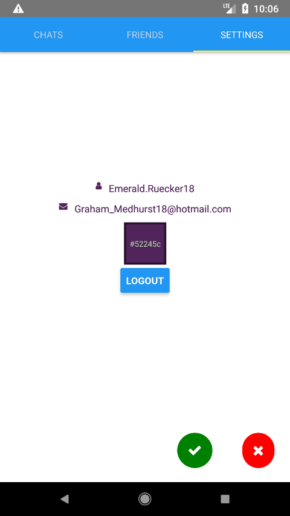

# Examen Final

# Día 25/02/2019 Tiempo: 5 horas

- Nota: Cada pregunta se valorará como bien o como mal (valoraciones intermedias serán excepcionales).
- Nota2: En cada pregunta se especifica si se valora en el examen de diseño o en el de desarrollo.
- Nota3: Para aprobar cada examen hay que obtener una puntuación mínima de 5 puntos en ese examen.
- Nota4: Organice su tiempo. Si no consigue resolver un apartado pase al siguiente. El examen consta de ejercicios que se pueden resolver de forma independiente. Los apartados de diseño y de desarrollo también se pueden resolver por separado. Si un apartado depende de otro que no sabe resolver, siempre puede dar una solución que aunque no sea correcta, le permita seguir avanzando.
- Nota5: Para que una solución sea correcta, no sólo hay que conseguir que haga lo que se pide, sino que además todo lo que funcionaba lo tiene que seguir haciendo.
- Nota6: En el examen se le da implementado el servidor y no se puede modificar. Cualquier modificación del servidor, invalidará las preguntas que se hayan resuelto y que usen esa modificación.
- Nota7: Lea completamente el examen antes de empezar y comience por lo que le parezca más fácil.

Pasos previos antes de empezar:

- Clone el repositorio del enunciado

```bash
    git clone https://user-daw-zayas@bitbucket.org/surtich/chatty-enunciado-final.git
```

- Configure su usuario de Git (es único para todos)

```bash
    cd chatty-enunciado-final
    git config user.name "user-daw-zayas"
    git config user.email "javier.perezarteaga@educa.madrid.org"
```

- Cree un _branch_ con su nombre y apellidos separados con guiones (no incluya mayúsculas, acentos o caracteres no alfabéticos, excepción hecha de los guiones). Ejemplo:

```bash
    git checkout -b fulanito-perez-gomez
```

- Compruebe que está en la rama correcta:

```bash
    git status
```

- Suba la rama al repositorio remoto:

```bash
    git push origin nombre-de-la-rama-dado-anteriormente
```

- Arranque el proyecto.

```bash
    # Instale dependencias del servidor
    yarn install

    # Inicie el servidor
    yarn dev

    # Instale dependencias del cliente
    cd client
    yarn install

    # Configure el cliente usando renombrando el fichero ./client/.env.example y poniendo su IP
    mv .env.example .env


    # Inicie el emulador de Andorid

    # Despliegue el cliente en el emulador
    react-native start --reset-cache
    react-native run-android

    # Abra una pestaña en el navegador con la librería color (le será útil durante la resolución del examen)
    google-chrome https://github.com/Qix-/color &

    # También le será de utilidad faker
    google-chrome https://github.com/Marak/Faker.js#readme
```

- Compruebe que la aplicación se ve en el móvil y que carga datos del servidor.

- Dígale al profesor que ya ha terminado para que compruebe que todo es correcto y desconecte la red.

## EXAMEN

#### 1.- En la ventana de `sign up`, mostrar/visualizar la contraseña estará sincronizado.


#### 1.1- (2 punto desarrollo) Al pulsar sobre uno de los ojos (cualquiera de ellos) se visualizarán/ocultarán las dos contraseñas.

#### 1.2- (1 punto diseño) Cuando navegue de `login` a `sign up` y viceversa, la contraseña siempre estará oculta incluso si en la vista anterior se estuviera mostrando.

#### 2.- Se podrá actualizar el color del perfil de un usuario.


#### 2.1- Cree un botón que permita editar el perfil del usuario.


#### 2.1.1- (1 punto diseño) Por crear un icono con nombre `pencil` con los colores, tamaño, margen interno y forma de la imagen.

#### 2.1.2- (1 punto diseño) Por posicionar correctamente el icono abajo a la derecha y respetando los márgenes. El resto de elementos de la ventana deben mantenerse correctamente posicionados.

#### 2.2.- Al pulsar sobre el botón de edición se ocultará y se mostrarán dos botones (con iconos `cross`y `check`), uno para cancelar y otro para aceptar las modificaciones.


#### 2.2.1- (1 punto desarrollo) Por ocultar y visualizar correctamente los botones. Al pulsar sobre cancelar o sobre aceptar se volverá a la vista inicial. Deberá hacer también lo que se dice en 2.3.3

#### 2.2.2- (1 punto diseño) Por mostrar los dos botones correctamente posicionados y con el estilo de la imagen.

#### 2.2.3- (1 punto diseño) Los tres botones tendrán un "efecto de pulsado". Puede usar `TouchableOpacity` para conseguir esto.

#### 2.3.- Al entrar en modo edición se pondrá un borde alrededor del color del usuario y se mostrará el valor del color.



#### 2.3.1- (1 punto diseño) El borde tendrá el grosor de la imagen y el color será el mismo que el del perfil pero más oscuro (la librería color le puede ser de utilidad aquí).

#### 2.3.2- (1 punto diseño) El valor tendrá un color que siempre será visible (no sé confundirá con el fondo) y estará centrado en el interior del cuadrado. Respete los márgenes internos.

#### 2.3.3- (valorado ya en 2.2.1) Al cancelar, se eliminará el borde y el valor del color.

Nota: Observe que aquí hay una pequeña confusión ya que este apartado se valora en desarrollo pero se refiere a deshacer algo  hecho en diseño. Bien, si no hizo lo especificado en 2.3.1 y 2.3.2,, para obteber una valoración positiva, deberá al menos ser capaz de mostrar y ocultar el valor del color aunque no esté bien posicionado.

#### 2.4.- Al entrar en modo edición se propondrán cuatro colores aleatorios adicionales, quedando en el centro el que actualmente tiene el usuario.


#### 2.4.1- (1 punto diseño) Por generar y posicionar los colores correctamente.

Nota: Puede usar `faker` para la generación de colores aleatorios. Mire con se hace esto en el servidor.

#### 2.4.2- (1 punto desarrollo) Al pulsar sobre uno de los colores, se quitará el borde del anterior y se pondrá sobre el pulsado. También se ocultará y visualizará el valor del color deseleccionado/seleccionado respectivamente.

Nota: Si no supo cómo colocar correctamente el valor del color (2.3.2) y el borde (2.3.1) para sumar en esta pregunta deberá, al menos, mostrar y ocultar, respectivamente, el valor del color aunque no esté bien posicionado.


#### 2.4.3- (1 punto diseño) Al pulsar sobre los colores se deberá usar un `TouchableOpacity` para producir un "efecto de pulsado". Si se pulsa sobre el color que ya está seleccionado, no se producirá el "efecto de pulsado".

Nota: Dado que ya se ha valorado en 2.2.3 cómo poner un efecto de pulsado, aquí lo que se valorará es si es capaz de quitarlo cuando sea necesario.

#### 2.4.4- (1 punto desarrollo) Por evitar la repetición de código al visualizar los cinco colores. Para hacer esto debe crear un componente que muestre el color y que reciba las propiedades necesarias que eviten la repetición. Este componente debe ser llamado cinco veces. Debe usar un bucle o métodos de `Ramda` o de `arrays` para evitar hacer cinco llamadas.

Nota: No olvide poner una `key` distinta a cada uno de los cinco componentes para evitar el `warning` correspondiente. Se penalizará el no poner la `key`.


#### 2.5.- Estando en modo edición, si no ha cambiado el color del usuario no se podrá pulsar el botón de guardar los cambios.


#### 2.5.1- (1 punto diseño) Al botón de aceptar se mostrará semitransparente cuando no se haya cambiado el color del usuario y opaco cuando sí se haya modificado. El "efecto de pulsado" se habilitará/deshabilitará según corresponda .

#### 2.5.2- (1 punto desarrollo) Cuando no haya cambios no se podrá pulsar sobre el botón aceptar.

Nota: No se saldrá del modo edición y no se producirá la mutación del ejercicio 2.6. Para valorar este apartado, comó mínimo debe haber implementado lo que se pide en el apartado 2.2.1

#### 2.5.3- (1 punto desarrollo) Al pulsar el botón cancelar se mostrará el color que originalmente tuviera el usuario incluso si se hubiera seleccionado otro.

#### 2.6.- Al pulsar sobre aceptar, se llamará a la mutación del servidor `updateProfile`y se actualizará la información del perfil. Se volverá a la vista inicial de `settings` mostrando el nuevo color.

#### 2.6.1- (1,5 puntos desarrollo) Por llamar a la mutación del servidor correctamente de tal manera que se actualice la base de datos.

#### 2.6.2- (1,5 puntos desarrollo) Por actualizar el color en la vista.

Nota: Hay muchas formas de hacer esto, unas más difíciles que otras y más correctas o menos. Aquí lo que se va a valorar es que funcione correctamente sin importar la calidad de la solución. No se permite desconectar y volver a conectar al usuario. Cuando se navegue entre vistas, la información del nuevo color se debe mantener al volver a `settings`.

Nota2: La mutación updateProfile del servidor sólo devuelve el nuevo color pero ningún dato del usuario que se ha modificado. Esto se ha hecho así de forma intencionada y no se puede modificar.

## Para entregar

- Ejecute el siguiente comando para comprobar que está en la rama correcta y ver los ficheros que ha cambiado:

```bash
    git status
```

- Prepare los cambios para que se añadan al repositorio local:

```bash
    git add --all
    git commit -m "completed exam"
```

- Compruebe que no tiene más cambios que incluir:

```bash
    git status
```

- Dígale al profesor que va a entregar el examen.

- Conecte la red y ejecute el siguiente comando:

```bash
    git push origin <nombre-de-la-rama>
```

- Abandone el aula en silencio.
